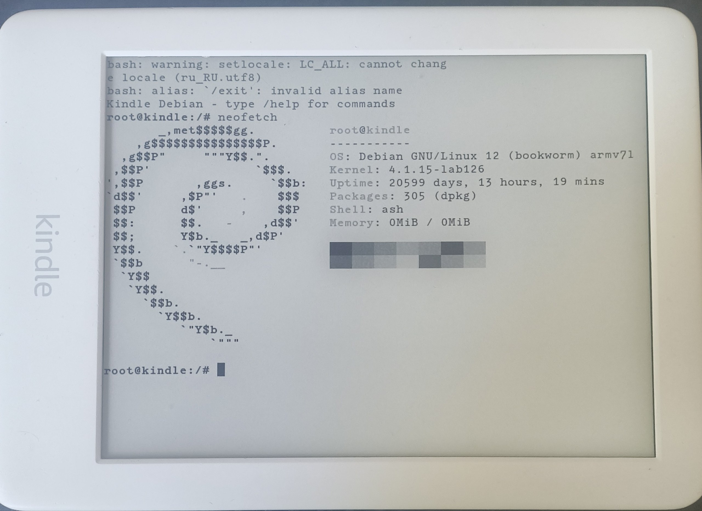

<h1 align="center">Kindle Linux Chroot</h1>

<p align="center">
  <strong>Turn your Amazon Kindle into a pocket Linux computer.</strong><br>
  Run Debian, Alpine, Arch, or any ARM distro  without touching the stock system.
</p>

<p align="center">
  <a href="#quick-start"></a>
  <a href="#supported-distros"></a>
  <a href="LICENSE"></a>
</p>

<p align="center">
  
</p>

---

## Overview

A set of scripts and a KUAL extension that let you run **any** ARM Linux distribution inside a `chroot` on a jailbroken Kindle. Your Kindle stays completely intact — everything lives inside a single `.ext3` image file on the USB storage partition.

**No dual-boot. No reflash. No risk. Just pure Linux on e-ink.**

### Table of Contents

- [Features](#features)
- [Supported Distros](#supported-distros)
- [Prerequisites](#prerequisites)
- [Quick Start](#quick-start)
- [Shell Commands](#built-in-shell-commands)
- [Examples](#examples)
- [How it Works](#how-it-works-technical)
- [Tested Hardware](#tested-hardware)
- [Troubleshooting](#troubleshooting)
- [Contributing](#contributing)

### Features

- One-command rootfs builder (Debian / Alpine out of the box)
- KUAL integration — launch Linux from the Kindle menu
- Built-in SSH server for comfortable remote access
- Custom shell commands (`/landscape`, `/portrait`, `/rotate`, `/ssh`, `/help`)
- Works on any jailbroken Kindle with KUAL + kterm installed

### Supported Distros

| Distro | Status | Package Manager | Build flag |
|--------|--------|----------------|-----------|
| Debian Bookworm | Fully tested | `apt` | `--distro debian` |
| Alpine 3.19 | Tested | `apk` | `--distro alpine` |
| Arch Linux ARM | Fully tested | `pacman` | `--distro arch` |
| Ubuntu 22.04 | Should work | `apt` | `--distro custom --rootfs-url <url>` |
| Void Linux | Should work | `xbps` | `--distro custom --rootfs-url <url>` |
| postmarketOS | Should work | `apk` | `--distro custom --rootfs-file <path>` |
| Any armhf distro | Use custom | varies | `--distro custom --rootfs-url <url>` |

> Any distro that provides an `armhf` (ARMv7 hard-float) rootfs tarball can be used with the `--distro custom` flag.

---

## Prerequisites

- A **jailbroken** Kindle (tested on Kindle 10th gen / PW4, should work on PW3+)
- [KUAL](https://www.mobileread.com/forums/showthread.php?t=203326) installed
- [kterm](https://github.com/bfabiszewski/kterm) installed
- A Linux PC (or macOS with Docker) for building the image
- Wi-Fi connection on Kindle (for SSH and package downloads)

---

## Quick Start

### Step 1: Build the rootfs image

**One-liner (no clone needed):**

```bash
curl -sL https://raw.githubusercontent.com/Sqrilizz/kindle-linux-chroot/main/scripts/build_rootfs.sh | sudo bash
```

This launches the interactive menu. Or with arguments:

```bash
curl -sL https://raw.githubusercontent.com/Sqrilizz/kindle-linux-chroot/main/scripts/build_rootfs.sh | sudo bash -s -- --distro debian --size 1024
```

**Or clone the repo:**

```bash
git clone https://github.com/sqrilizz/kindle-linux-chroot.git
cd kindle-linux-chroot/scripts
sudo bash build_rootfs.sh
```

This produces a `debian.ext3` (or `alpine.ext3`) file ready for the Kindle.

**Host dependencies:**
```bash
# Arch Linux
sudo pacman -S debootstrap qemu-user-static qemu-user-static-binfmt debian-archive-keyring

# Ubuntu / Debian
sudo apt install debootstrap qemu-user-static binfmt-support

# macOS (use Docker)
# See docs/docker-build.md
```

### Step 2: Deploy to Kindle

Connect your Kindle via USB and copy files:

```bash
KINDLE=/media/$USER/Kindle   # adjust to your mount point

# Copy the rootfs image
cp debian.ext3 $KINDLE/

# Copy the KUAL extension
cp -r ../extensions/LinuxChroot $KINDLE/extensions/

# Copy the SSH helper script
cp start-ssh.sh $KINDLE/

sync
```

### Step 3: Launch on Kindle

1. Safely eject and disconnect Kindle from USB
2. Open **KUAL** on your Kindle
3. Tap **Linux Chroot** → **Start Terminal**
4. You're now in a Debian bash shell!

### Step 4: SSH from your PC (recommended)

The on-screen keyboard works, but SSH is way more comfortable:

```bash
# On Kindle (in kterm), run:
/ssh

# On your PC:
ssh root@192.168.1.XXX -p 2222
# Password: kindle
```

---

## Built-in Shell Commands

Once inside the chroot, these custom commands are available:

| Command | Description |
|---------|-------------|
| `/help` | Show all available commands |
| `exit` | Cleanly exit the chroot |
| `/ssh` | Start SSH server (installs dropbear if needed) |
| `/wifi` | Show current Wi-Fi IP address |
| `/info` | Display system info (RAM, disk, kernel) |

---

## Examples

### First boot — update and install basics

```bash
# First thing after entering the chroot:
apt-get update
apt-get install -y neofetch curl wget git nano htop
neofetch
```

### Set up SSH for remote access

Instead of typing on the Kindle's tiny keyboard, SSH in from your PC:

```bash
# Inside the chroot on Kindle:
apt-get install -y dropbear
dropbear -R -p 0.0.0.0:2222 -B

# Now from your PC:
ssh root@192.168.1.42 -p 2222
# Password: kindle
```

### Install Python and run scripts

```bash
apt-get install -y python3 python3-pip
python3 -c "print('Hello from Kindle!')"

# Install packages
pip3 install requests
python3 -c "import requests; print(requests.get('https://ifconfig.me').text)"
```

### Run a local web server

```bash
# Serve files from the Kindle over Wi-Fi
apt-get install -y python3
mkdir -p /srv/www && echo "<h1>Served from Kindle!</h1>" > /srv/www/index.html
cd /srv/www && python3 -m http.server 8080 &

# Access from any device on your network:
# http://<kindle-ip>:8080
```

### Install Node.js

```bash
apt-get install -y nodejs npm
node -e "console.log('Node.js ' + process.version + ' running on Kindle!')"

# Run a simple express server
npm init -y && npm install express
node -e "
const app = require('express')();
app.get('/', (req, res) => res.send('Hello from Kindle!'));
app.listen(3000, () => console.log('http://0.0.0.0:3000'));
"
```

### Compile and run C code natively on Kindle

```bash
apt-get install -y gcc make

cat > hello.c << 'EOF'
#include <stdio.h>
#include <sys/utsname.h>

int main() {
    struct utsname buf;
    uname(&buf);
    printf("Hello from %s %s (%s)\n", buf.sysname, buf.release, buf.machine);
    return 0;
}
EOF

gcc -o hello hello.c && ./hello
# Output: Hello from Linux 4.1.15 (armv7l)
```

### Use as a penetration testing tool

```bash
apt-get install -y nmap netcat-openbsd dnsutils whois tcpdump

# Scan your local network
nmap -sn 192.168.1.0/24

# Port scan a host
nmap -sV 192.168.1.1

# DNS lookup
dig google.com

# Listen on a port
nc -lvp 4444
```

### Run a Minecraft server (yes, really)

```bash
# Install Java (headless)
apt-get install -y default-jre-headless

# Download a lightweight MC server
wget https://pocketmine-mp.github.io/bedrock-data/pocketmine.phar
php pocketmine.phar
# (Note: very slow on 256MB RAM, but it works for 1-2 players on LAN)
```

### Set up a Git server on Kindle

```bash
apt-get install -y git

# Create a bare repo
mkdir -p /srv/git/myproject.git
cd /srv/git/myproject.git
git init --bare

# From your PC (with SSH running on Kindle):
git remote add kindle root@<kindle-ip>:/srv/git/myproject.git
git push kindle main
```

### Run a Telegram bot

```bash
apt-get install -y python3 python3-pip
pip3 install python-telegram-bot

cat > bot.py << 'EOF'
from telegram import Update
from telegram.ext import ApplicationBuilder, CommandHandler, ContextTypes

async def hello(update: Update, context: ContextTypes.DEFAULT_TYPE):
    await update.message.reply_text(f'Hello from Kindle! Uptime: {open("/proc/uptime").read().split()[0]}s')

app = ApplicationBuilder().token("YOUR_BOT_TOKEN").build()
app.add_handler(CommandHandler("hello", hello))
app.run_polling()
EOF

python3 bot.py
```

### Use as a always-on IRC bouncer

```bash
apt-get install -y znc

# First-time setup
znc --makeconf
# Follow the prompts, then connect from any IRC client
```

### Download torrents

```bash
apt-get install -y transmission-cli

# Download a Linux ISO torrent
transmission-cli "magnet:?xt=urn:btih:..." -w /mnt/us/downloads/
```

### Run Alpine instead of Debian (lighter)

```bash
# On your PC, build Alpine image:
sudo ./build_rootfs.sh --distro alpine --size 256

# Copy to Kindle. The KUAL extension auto-detects alpine.ext3
# Alpine uses ~8MB base vs ~300MB for Debian
# Package manager: apk add <package>
```

### Run Arch Linux ARM (btw I use arch)

```bash
# On your PC:
sudo ./build_rootfs.sh --distro arch --size 2048

# Copy arch.ext3 to Kindle
# Package manager: pacman -Syu <package>
```

### Use any custom distro

Got a rootfs tarball for armhf? Just point the script at it:

```bash
# From a URL (Void Linux example):
sudo ./build_rootfs.sh --distro custom \
    --rootfs-url https://repo-default.voidlinux.org/live/current/void-armv7l-ROOTFS-20230628.tar.xz \
    --size 1024

# From a local file:
sudo ./build_rootfs.sh --distro custom \
    --rootfs-file ~/Downloads/my-rootfs-armhf.tar.gz \
    --size 512

# The image will be named custom.ext3
# Rename it to anything: mv custom.ext3 void.ext3
# The KUAL extension auto-detects any .ext3 file in /mnt/us/
```

---

## How it works (technical)

```
┌─────────────────────────────────────┐
│         Kindle Hardware             │
│  (ARM Cortex-A7, 256MB RAM, e-ink)  │
├─────────────────────────────────────┤
│      Stock Kindle Linux Kernel      │
│           (4.1.15)                  │
├──────────────┬──────────────────────┤
│ Kindle OS    │   Linux Chroot       │
│ (Java GUI)   │   ┌────────────────┐ │
│              │   │ debian.ext3    │ │
│  ┌────────┐  │   │ mounted at     │ │
│  │ KUAL   │──┼──>│ /tmp/debian    │ │
│  │ kterm  │  │   │                │ │
│  └────────┘  │   │ bind mounts:   │ │
│              │   │  /dev /proc    │ │
│              │   │  /sys          │ │
│              │   └────────────────┘ │
└──────────────┴──────────────────────┘
```

The key insight: Kindle already runs Linux (kernel 4.1.15). We don't replace anything — we just mount an additional filesystem and `chroot` into it. The chroot shares the host kernel, so all hardware (Wi-Fi, touchscreen, framebuffer) is accessible.

---

## Directory Structure

```
kindle-linux-chroot/
├── README.md
├── scripts/
│   ├── build_rootfs.sh       # Universal rootfs builder
│   └── start-ssh.sh          # SSH server launcher for Kindle
├── extensions/
│   └── LinuxChroot/          # KUAL extension
│       ├── config.xml
│       ├── menu.json
│       └── bin/
│           ├── shell.sh      # Mount + launch kterm
│           └── stop.sh       # Unmount chroot
└── docs/
    ├── screenshot.jpg
    ├── troubleshooting.md
    └── advanced.md
```

---

## Tested Hardware

This project was developed and tested on the following device:

| Spec | Value |
|------|-------|
| **Device** | Amazon Kindle 10th Generation (2019) |
| **SoC** | NXP/Freescale i.MX7 (some units ship with i.MX6 SoloLite) |
| **CPU** | Single-core ARM Cortex-A7/A9 @ 1 GHz, armv7l, no NEON |
| **RAM** | 512 MB (~300 MB free after KindleOS) |
| **Storage** | 8 GB eMMC (~6.2 GB user-accessible) |
| **Display** | 6", 167 PPI, e-ink Carta, no frontlight on base model |
| **Wi-Fi** | 2.4 GHz 802.11n |
| **Bluetooth** | Yes, audio only |
| **Kernel** | Linux 4.1.15 |
| **Firmware** | 5.18.1 (jailbroken via WinterBreak/Mesquito) |

### Should also work on:

- Kindle Paperwhite 3 (PW3 / Voyage) — same SoC family
- Kindle Paperwhite 4 (PW4, 2018) — i.MX 6SoloLite, 300 PPI
- Kindle Paperwhite 5 (PW5, 2021) — i.MX 7, newer kernel
- Kindle Basic 8th/10th gen — same architecture
- Any jailbroken Kindle with `armhf` kernel and KUAL support

> If you test on a different model, please open an issue or PR with your results!

---

## Troubleshooting

| Problem | Solution |
|---------|----------|
| "Cannot mount ext3" | Make sure the image file isn't corrupted. Re-run `build_rootfs.sh` |
| No internet in chroot | Check `/etc/resolv.conf` inside chroot. Run: `echo "nameserver 8.8.8.8" > /etc/resolv.conf` |
| `apt-get` hangs | Kindle Wi-Fi may have dropped. Reconnect and retry |
| kterm won't launch | Ensure kterm extension is installed correctly in `/mnt/us/extensions/kterm/` |
| SSH connection refused | Run `/ssh` inside the chroot first. Check Kindle is on Wi-Fi |
| Out of disk space | Build a larger image: `--size 2048` for 2GB |
| Screen rotation doesn't work | Your Kindle model may not support `/sys/class/graphics/fb0/rotate` |

---

## Limitations

- **Kernel version is fixed** — you use whatever kernel Kindle ships with (4.1.15 on most models). You cannot load custom kernel modules.
- **RAM is limited** — 256MB total, shared with Kindle OS. Don't run heavy workloads.
- **No systemd** — the kernel is too old and PID 1 is Kindle's init. Services must be started manually.
- **No GPU acceleration** — framebuffer only, no OpenGL.
- **Storage is slow** — internal eMMC is not fast. Large `apt` operations take time.

---

## Contributing

PRs welcome! Ideas for contribution:
- Add more distro support (Void, Gentoo, postmarketOS)
- Improve KUAL menu with status indicators
- Add a script to resize ext3 images
- Write a Docker-based builder for macOS users

---

## Credits

- [KUAL](https://www.mobileread.com/forums/showthread.php?t=203326) by knc1
- [kterm](https://github.com/bfabiszewski/kterm) by bfabiszewski
- Kindle jailbreak community at [MobileRead](https://www.mobileread.com/forums/forumdisplay.php?f=150)

## License

MIT
